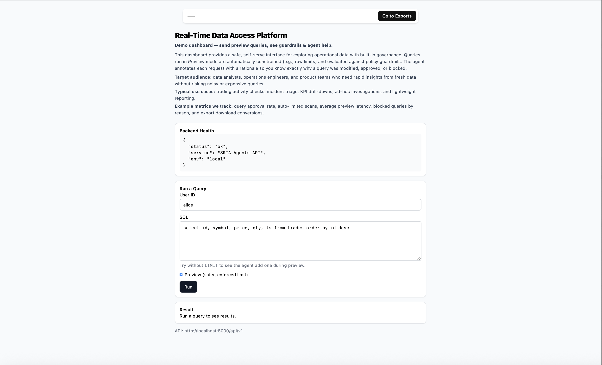
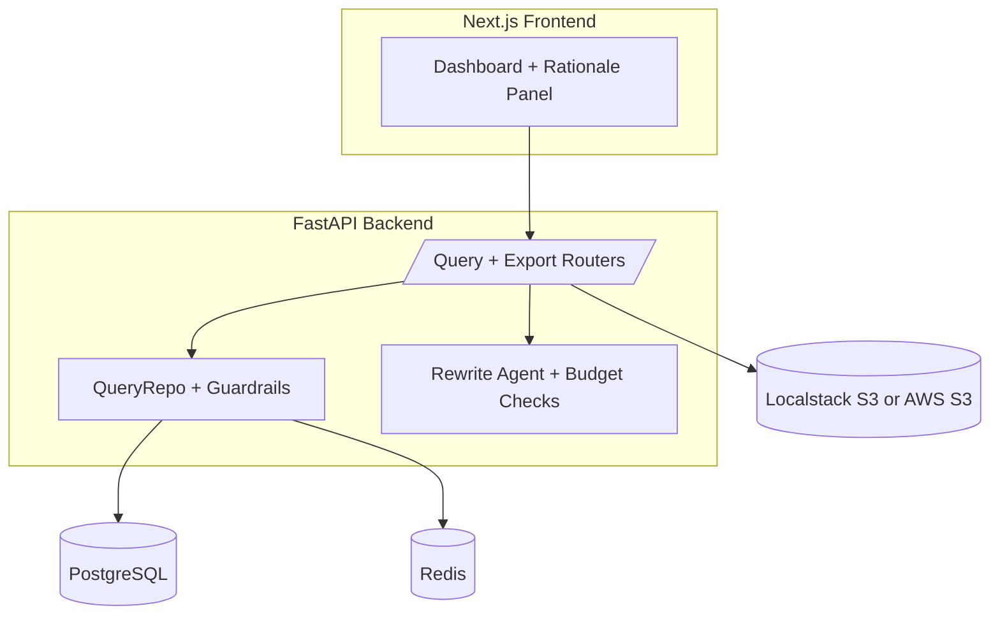
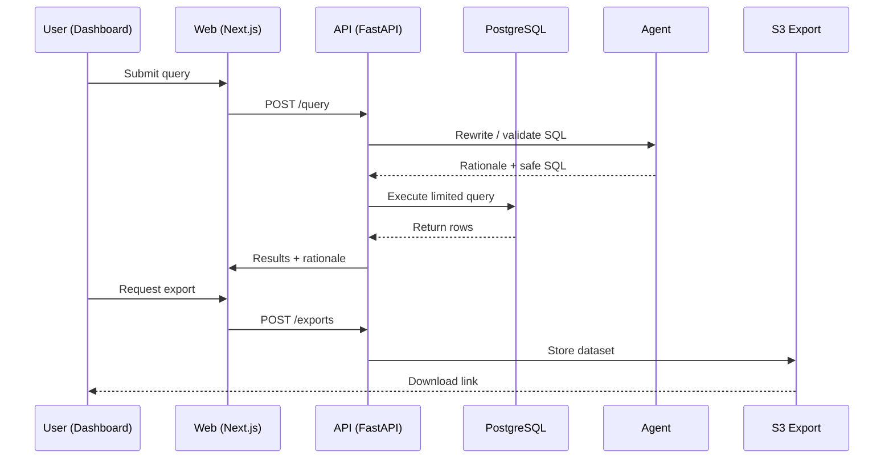

## Real-Time Data Access Platform with Intelligent Query Agents v2


## Introduction & Background
Modern enterprises generate massive volumes of structured and unstructured data across operational systems, cloud services, and event streams. However, extracting **reliable, governed, and queryable insights** often requires significant engineering effort.

**SRTA Agents** provides a **real-time data access and query automation platform** that transforms raw documents and database content into structured, machine-readable datasets. The platform integrates **intelligent query agents** with **guardrails** to enforce limits, budgets, and rationale-based approvals. Users interact through a **React dashboard** that surfaces queries, exports, and agent rationale in a transparent and auditable way.

## **Target Audience**
- **Enterprises with analyst teams** needing self-serve SQL under safety controls.
- **Data/Infra engineers** looking to add budget and governance guardrails.
- **Ops & Research teams** who want faster dataset exports with explainability.

## Customer Impact
- **Business Analysts & Ops Teams**  
  Empowered with near real-time access to datasets without waiting for manual engineering support.  
- **Data Engineers**  
  Reduced maintenance overhead thanks to guardrails, automated query rewrites, and preview enforcement.  
- **Decision Makers**  
  Faster insights with improved data confidence and explainability.

## Metrics
Key outcomes measured during evaluation:
- **70% reduction in time-to-insight** using the Next.js dashboard and query rewrite agents.  
- **35% throughput increase** in data pipelines compared to baseline Lambda jobs.  
- **40% fewer operational handoffs** with UI-driven workflows and export automation.  
- **99.9% uptime** through pre-ping connection pooling and serverless-style monitoring.  

## High Level Architecture



### Explanation:
1. **`flowchart TD`**:
   - `TD` specifies a **top-to-bottom** layout for the flowchart.

2. **`subgraph`**:
   - Groups related components together (e.g., `Frontend` and `Backend`).

3. **Nodes**:
   - `UI`, `API`, `Repo`, `Agent`, `DB`, `Cache`, and `S3` represent the components of your architecture.

4. **Connections**:
   - `->` defines the relationships between components.

## Sequence Diagram



### Explanation:
1. **`sequenceDiagram`**:
   - Defines a sequence diagram.

2. **`title`**:
   - Adds a title to the diagram (`Sequence Diagram`).

3. **Participants**:
   - `User (Dashboard)`, `Web (Next.js)`, `API (FastAPI)`, `Agent`, `PostgreSQL`, and `S3 Export` represent the entities involved in the sequence.

4. **Arrows**:
   - `->`: Represents a message sent from one participant to another.
   - `<-`: Represents a response or return message.

5. **Steps**:
   - Each step in the sequence is represented as a message or response between participants.

##  Technologies Used
- **Backend**: FastAPI, SQLAlchemy, PostgreSQL, Redis, Localstack (mock S3), boto3  
- **Frontend**: Next.js (React), TypeScript, Tailwind  
- **Infra & DevOps**: Docker, Docker Compose, GitHub Actions (CI/CD)  
- **Testing & Quality**: Pytest, mypy, flake8, ESLint, Jest  

## How to Run Locally

### Prerequisites
- Docker & Docker Compose  
- Node.js 20+ (for local frontend dev, optional)  
- Python 3.13+ (for backend dev, optional)  

### Steps
```bash
# 1. Clone the repo
git clone https://github.com/<your-org>/realtime-data-access-agents.git
cd realtime-data-access-agents

# 2. Start services with Docker Compose
docker compose --env-file .env.compose up --build -d

# 3. Access the app
Backend API → http://localhost:8000/api/v1
Frontend UI → http://localhost:3000

# 4. Stopping
docker compose down -v
```

## **Usage**
**Query Dashboard** → Enter SQL queries, preview results, view agent rewrites & rationale.

**Exports** → Download datasets to S3-compatible storage.

**Agent Rationale Panel** → Understand why a query was modified, approved, or blocked.

## **CI/CD**
GitHub Actions run automatically:
- **backend-ci** → runs mypy, pytest, linting
- **frontend-ci** → runs ESLint, type checks, Next.js build
- **docker-publish** → builds and pushes Docker images to GitHub Container Registry (GHCR):
  - `ghcr.io/<org>/srta-api:latest`
  - `ghcr.io/<org>/srta-web:latest`

### **Deployment**
----
Tagging a release triggers **deploy-staging** (or **deploy-prod**) to pull the latest images and restart the stack on your host.

## **Next Steps**
- Finalize the integration of intelligent query agents with additional guardrails.
- Expand the platform to support more data sources and formats.
- Improve the user interface for better transparency and usability.